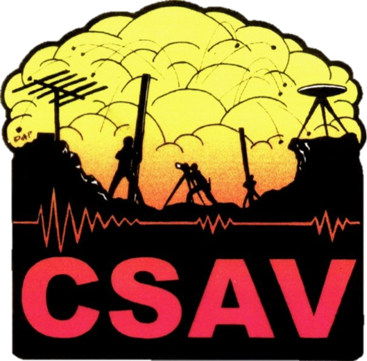

# CSAV Seismology

  

## 🚧 ⚠️ Repository Under Development ⚠️ 🚧

This repository contains a collection of Jupyter notebooks for teaching **Volcano Seismology** at the [Center for the Study of Active Volcanoes (CSAV)](https://hilo.hawaii.edu/csav/).

**Note:** This repository is currently under active development. Content may be incomplete, subject to change, and should be used with caution.

---

### About

CSAV is a cooperative program of the University of Hawaiʻi at Hilo, the Hawaiian Volcano Observatory (HVO), and the University of Hawaiʻi at Mānoa (UHM), providing training and outreach on volcanic and natural hazards since 1989. Seismology coursework is tought by the [USGS Volcano Disaster Assistance Program](https://volcanoes.usgs.gov/vdap/about.html).

### Contact

For more information about CSAV, visit: https://hilo.hawaii.edu/csav/
